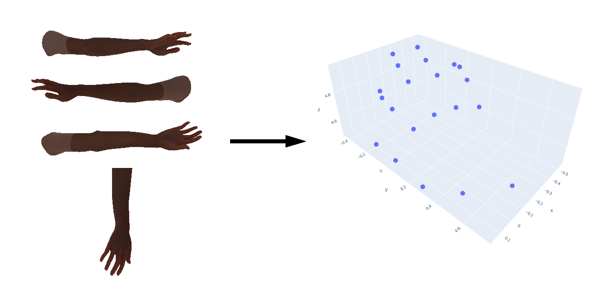

# OpenPose 3D Handpose extractor

[OpenPose](https://github.com/CMU-Perceptual-Computing-Lab/openpose) has a 3D reconstruction module which works well when the entire human is present the frame. However, standalone hand keypoint detection requires one to provide bounding boxes around the hand. Moreover, the python wrapper segfaults in asynchronous mode (see [#1830](https://github.com/CMU-Perceptual-Computing-Lab/openpose/issues/1739)). This repository contains two things
1. A modified `PythonWrapper` for OpenPose.
2. A Python script which takes images and camera parameters as input, performs hand detection using [MediaPipe Hand](https://google.github.io/mediapipe/solutions/hands.html) top produce the 3D keypoints.

<figure>
  

    
  

</figure>

## Installation
1. Clone the OpenPose repository.
2. Copy the [openpose_python.cpp](./openpose_python.cpp) to `<OPENPOSE_DIR>/python/openpose`.
3. Build the OpenPose.

## Disclaimer
This script hasn't been tested thoroughly and shouldn't be used in a production environment.
